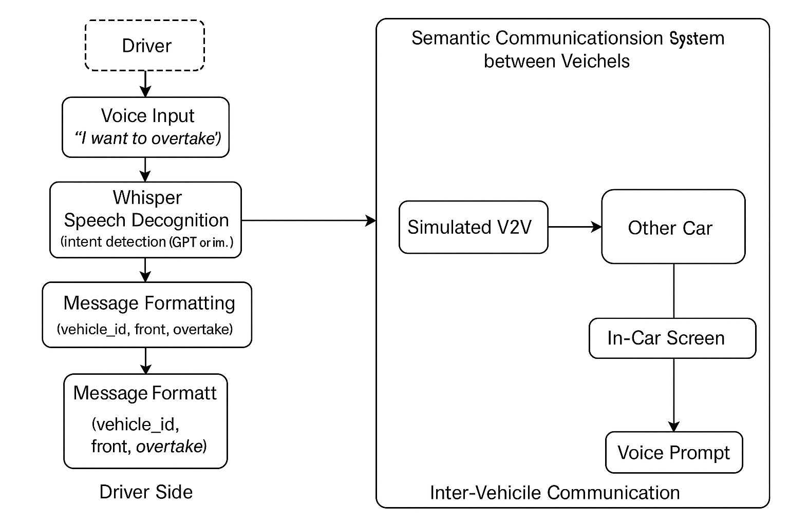

## Author: 陳胤亮、陳裕穎  
# **Workflow**

See workflow.png

## Details

### 1. Driver --> Voice Input --> Whisper Speech Detection --> ...

Input data type: .wav  
Output data type: .txt   

### 2. Whisper Speech Detection  --> Message Formatting --> ...

Input data type: .txt   
Output data type: .json 

### 3.1 Message Formatting --> Function Call --> ...

Input data type: .json  
Output data type: .json   

### 3.2 Message Formatting --> Driver Check --> ...

Input data type: .json   
Output data type: bool   

#### 3.2.1 Incorrect: Driver Check --> Tell Driver Voice Input Err and Again

Input data type: bool   
Output data type: .wav   

#### 3.2.2 Correct --> Function Call

Input data type: bool   
Output data type: .json   

### 4. Deliver to target car
